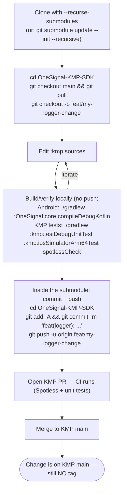
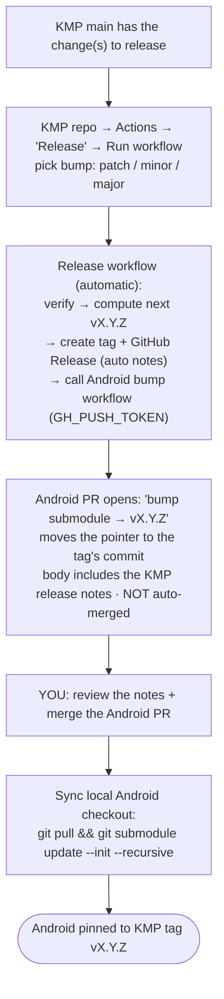

# Contributing to the OneSignal Android SDK

:+1::tada: First off, thanks for taking the time to contribute! :tada::+1:

### How to Contribute
We love the open source community and enjoy the support and contributions of many of our users. We ask that any potential contributors to the SDK Follow the following guidelines:

If your proposed contribution is a small bug fix, please feel free to create your own fork of the repository and create a pull request.

If your contribution would _break_ or _change_ the functionality of the SDK, please reach out to us on (contact) before you put in a lot of effort into a change we may not be able to use. We try our best to make sure that the SDK remains stable so that developers do not have to continually change their code, however some breaking changes _are_ desirable, so please get in touch to discuss your idea before you put in a lot of effort.

### Building the SDK from source

The shared Kotlin Multiplatform `:kmp` module lives in the standalone [OneSignal-KMP-SDK](https://github.com/OneSignal/OneSignal-KMP-SDK) repository and is consumed here as a git submodule pinned to a specific commit. Its sources are checked out under `OneSignal-KMP-SDK/`, so you must initialize the submodule before building or the Gradle build will fail (the remapped `:OneSignal:kmp` project directory won't exist).

```bash
# Fresh clone (recommended)
git clone --recurse-submodules git@github.com:OneSignal/OneSignal-Android-SDK.git

# If you already cloned without --recurse-submodules
git submodule update --init --recursive
```

Whenever you pull changes that move the submodule pointer, re-run `git submodule update --init --recursive` to sync your local checkout to the pinned commit.

### Working on the shared `:kmp` module

The `:kmp` sources live in the KMP repo and are checked out here, nested, at `OneSignal-KMP-SDK/`. This means **two gits are in play**:

- Commands run from the **Android repo root** act on Android and only record the submodule *pointer* (a `160000` gitlink SHA) — not the logger source.
- Commands run from **inside `OneSignal-KMP-SDK/`** act on the KMP repo — that's where the actual `.kt` changes are committed.

Because Gradle reads the module from the submodule folder on disk, your **uncommitted** KMP edits compile straight into the Android app — no push or version bump is needed while iterating.

There are two distinct flows: everyday development (Flow A) and releasing (Flow B).

#### Flow A — Local development (edit → commit → push → merge)

Ends when your change is on KMP `main`. **No tagging and nothing ships to Android here.**



> The submodule starts in **detached HEAD** at the pinned commit. Run `git checkout main` (or `-b <feature>`) inside `OneSignal-KMP-SDK/` before committing, or your commit will be orphaned.

#### Flow B — Release & pin Android to a tag

Run this when a merged KMP `main` should actually ship into the Android (and later iOS) SDK. **Manual trigger**; Android itself is never tagged — only its submodule *pointer* moves to the KMP tag.



The only manual actions in Flow B are **Run workflow** and **merge the bump PR**; everything in between is automated.

#### Before Submitting A Bug Report
Before creating bug reports, please check this list of steps to follow.

1. Make sure that you are actually encountering an _issue_ and not a _question_. If you simply have a question about the SDK, we would be more than happy to assist you in our Support section on the web (https://www.onesignal.com - click the Message button at the bottom right)
2. Please make sure to [include as many details as possible](#how-do-i-submit-a-good-bug-report)

> **Note:** If you find a **Closed** issue that seems like it is the same thing that you're experiencing, open a new issue and include a link to the original issue in the body of your new one.


#### How Do I Submit a Good Bug Report
* **Use a clear and descriptive title** for the issue to identify the problem.
* **Include Reproducibility** It is nearly always a good idea to include steps to reproduce the issue. If you cannot reliably reproduce the issue yourself, that's ok, but reproducible steps help best.
* **Describe your environment**, tell us what version of the Android SDK you are using, how you added it to your project (ie. maven or manually adding it to your project), what version of Android you are targeting, and so on.
* **Include a Stack Trace** If your issue involves a crash/exception, ***PLEASE*** post the stack trace to help us identify the root issue.
* **Include an Example Project** This isn't required, but if you want your issue fixed quickly, it's often a good idea to include an example project as a zip and include it with the issue. You can also download the Demo project (included in the `/Examples` folder of this repo) and set up an example project with this code as a starting point.
